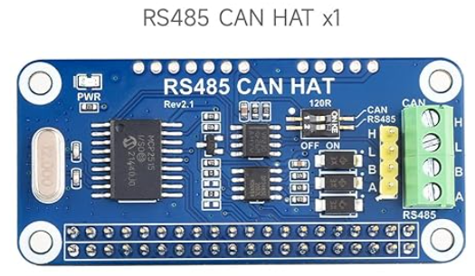

# Setup SocketCAN  

## Introduction

SocketCAN is a set of **open-source CAN (Controller Area Network) drivers and 
a networking stack integrated into the Linux kernel**. It allows Linux-based 
systems, such as the Raspberry Pi, to communicate with CAN bus systems. 

The CAN bus is widely used in automotive, industrial, and embedded systems to 
enable communication between different devices.

SocketCAN provides a socket-based interface, **similar to networking sockets**, 
to interact with CAN devices. This makes it easy for developers to write CAN-based 
applications without having to deal with low-level CAN protocol specifics.


## Hardware Requirements 

To connect the Raspberry Pi to a CAN bus, we need:

* Raspberry Pi (any model with GPIO support)

* CAN transceiver hardware:
    * A **CAN HAT** for Raspberry Pi (e.g., PiCAN2 or similar)

    

    * A USB-to-CAN adapter (e.g., PEAK USB CAN interfaces)

    * A CAN transceiver circuit using an MCP2515 + MCP2551 or equivalent chipset


## Bring Up the CAN Interface

We have to activate the SPI interface on the Raspberry Pi to communicate with 
the MCP2515 CAN controller. 

In the **/boot/firmware/config.txt** file, add the following two lines and 
rebbot the system:

```Bash
$ sudo vim /boot/firmware/config.txt 

dtparam=spi=on 
dtoverlay=mcp2515-can0,oscillator=12000000,spimaxfrequency=2000000,interrupt=25

$ sudo reboot
```

Now, we can configure the communication parameters for the CAN interface:

```Bash
$ ip link show can0
3: can0: <NOARP,ECHO> mtu 16 qdisc noop state DOWN mode DEFAULT group default qlen 10 link/can

$ sudo ip link set can0 type can bitrate 500000
$ sudo ip link set can0 txqueuelen 1000
$ sudo ip link set can0 up
```

Here, `can0` is the CAN interface, and the bitrate is set to `500,000` bits per 
second. Adjust the bitrate based on your CAN network requirements.

To make these settings persistent across reboots, add the following lines to
the **/etc/rc.local** file and set the permissions to execute:

```Bash
sudo vi /etc/rc.local 

#!/bin/sh -e
# 
# rc.local 
#

ip link set can0 type can bitrate 500000
ip link set can0 txqueuelen 1000
ip link set can0 up

exit 0

$ sudo chmod +x /etc/rc.local
$ sudo reboot
```

Now the CAN interface is up and running. We can use the `candump` and 
`cansend` commands from the `can-utils` package to monitor and send CAN 
messages, respectively.


## Install **can-utils** Package

Ensure our Raspberry Pi has the necessary kernel modules for CAN support.

```
$ sudo apt install can-utils
```

The can-utils package provides essential tools for working with SocketCAN, 
such as candump, cansend, and cangen.


## References

* [SocketCAN userspace utilities and tools](https://github.com/linux-can/can-utils)

* [Linux Kernel: SocketCAN - Controller Area Network](https://www.kernel.org/doc/html/latest/networking/can.html)

* [Linux CAN Bus Setup](https://youtu.be/t2GzXpAd8ic?si=6menou6Hl3L6GTSc)
    - Wireshark knows the CAN protocol 

* [Waveshare: RS485 CAN HAT](https://www.waveshare.com/wiki/RS485_CAN_HAT):
    
    Using CAN controller MCP2515 via SPI interface, onboard transceiver SIT65HVD230DR.
    RS485 function, controlled via UART, half-duplex communication, supports automatic 
    TX/RX control without programming, onboard transceiver SP3485.

* [YouTube: RS485 CAN BUS HAT MCP2515 Raspberry pi and Arduino](https://youtu.be/xY5S8YGI72g?si=lkc3kZM10NIoWBgU)


*Egon Teiniker, 2024-2025, GPL v3.0*
