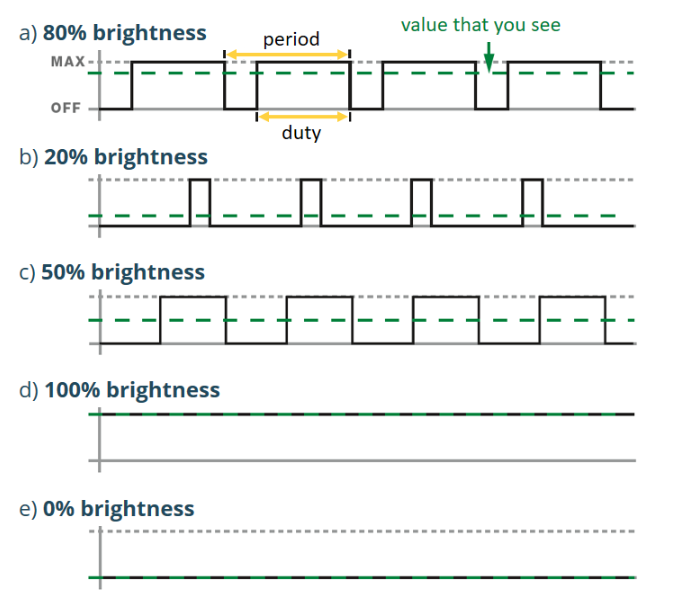

# Example: PWM

**Pulse Width Modulation (PWM)** simulates an analog output level on a 
digital (ON/OFF only) pin by switching it HIGH and LOW very quickly. 
Two parameters describe the resulting signal:

* **Frequency**: how many ON/OFF cycles happen per second.
* **Duty cycle**: the fraction of each cycle the signal stays HIGH, 
    expressed from 0% (always LOW) to 100% (always HIGH).



_Figure: How PWM Works (Random Nerd Tutorials)_

If the frequency is high enough, an LED does not perceptibly flicker — 
instead, the eye (and inertial loads like motors) average the signal 
over time, so a 25% duty cycle looks/feels like roughly a quarter of 
full brightness/power. This is how `gpiozero` implements **dimming**, 
without any external hardware.


## Software PWM

Only a handful of the Raspberry Pi's GPIO pins are wired to the SoC's 
dedicated **hardware PWM peripheral** (e.g. GPIO12/13/18/19), which 
toggles the pin autonomously using an internal clock, with no CPU 
involvement once configured. Every other pin has no such peripheral 
behind it.

To still support PWM on *any* GPIO pin, `gpiozero` falls back to 
**software PWM**: a background thread that repeatedly toggles the pin 
via `GPIO_V2_LINE_SET_VALUES_IOCTL` calls, sleeping for calculated ON 
and OFF intervals to approximate the requested frequency and duty 
cycle. This costs CPU time and is less precise than hardware PWM 
(subject to OS scheduling jitter), but is perfectly adequate for 
visual effects like fading an LED.

```python
from gpiozero import PWMLED
from time import sleep

# Software PWM: works on any pin
led = PWMLED(17)

while True:
    # Duty cycle value ranges from 0.0 (0%) to 1.0 (100%)
    for duty in range(0, 101, 5):
        led.value = duty / 100.0
        sleep(0.05)
    for duty in range(100, -1, -5):
        led.value = duty / 100.0
        sleep(0.05)
```

GPIO17 has no hardware PWM channel behind it, so `PWMLED` transparently 
creates a **software PWM** output at a default frequency of 100Hz. 
Setting `led.value` does not directly drive the pin — it only updates 
the duty cycle that the background thread uses on its next cycle. The 
`for` loops ramp `value` from `0.0` to `1.0` and back down in `0.05` 
increments every 50ms, so the LED smoothly **fades in and out** rather 
than switching abruptly, producing a "breathing" effect.


## `PWMLED` vs. `PWMOutputDevice`

Both classes drive a pin with a PWM signal and expose the same core 
`value` (0.0–1.0), `on()`, `off()`, and `frequency` interface — the 
difference is one of intent:

* **`PWMOutputDevice`** is the generic building block for *any* 
    PWM-controlled output (motor drivers, buzzers, fans, ...). It only 
    concerns itself with producing the requested duty cycle; it has no 
    notion of what is connected to the pin.

* **`PWMLED`** is a thin, LED-specific subclass of `PWMOutputDevice`. 
    It reuses the same PWM machinery, but adds convenience methods 
    tailored to lighting effects that only make sense for an LED:
    * `blink(on_time, off_time, fade_in_time, fade_out_time, n, background)` 
        — blink, optionally fading between states.
    * `pulse(fade_in_time, fade_out_time, n, background)` 
        — repeatedly fade the LED up and down, like the loop above, 
        without writing the loop yourself.

    Both run in a background thread by default, so the main program is 
    free to do other work while the LED animates.

In short: use `PWMOutputDevice` when driving a generic load with a duty 
cycle, and `PWMLED` when the load is an LED and you want its built-in 
fade/blink/pulse helpers.


## References

* [gpiozero: PWMLED](https://gpiozero.readthedocs.io/en/stable/api_output.html#pwmled)
* [gpiozero: PWMOutputDevice](https://gpiozero.readthedocs.io/en/stable/api_output.html#pwmoutputdevice)
* [Raspberry Pi: PWM Outputs with Python](https://randomnerdtutorials.com/raspberry-pi-pwm-python/)

_Egon Teiniker, 2026, GPL v3.0_
