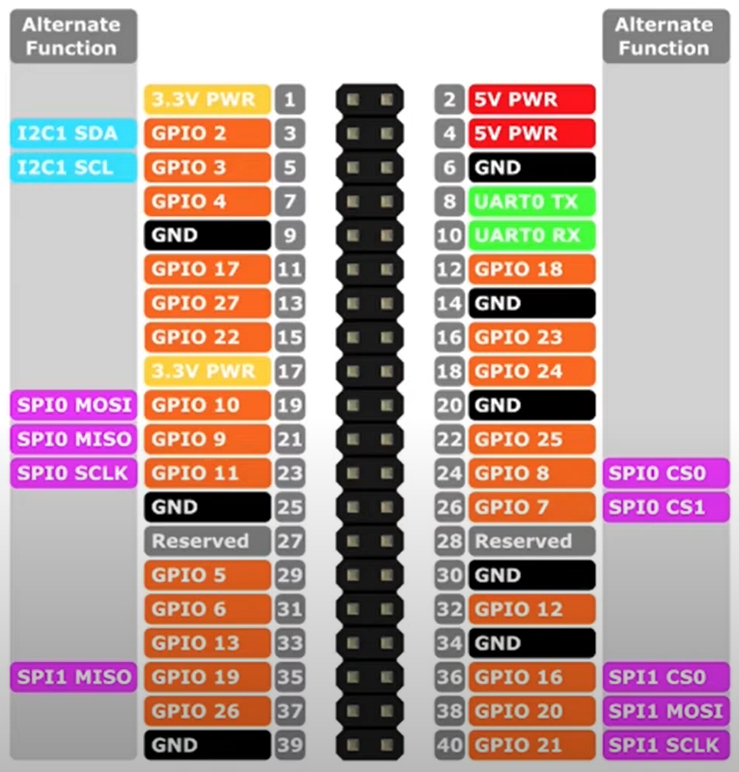

# General Purpose Input Output (GPIO) Port

The GPIO port connector is a 40-pin expansion header, arranged in a 2 x 20 strip.
The I/O ports are numbered as `GPIO nn`.

The GPIO provides 26 general-purpose bidirectional I/O pins.

An output pin can supply up to **16mA of current**. The total current drawn 
from all output pins should not exceed the 50mA limit.

