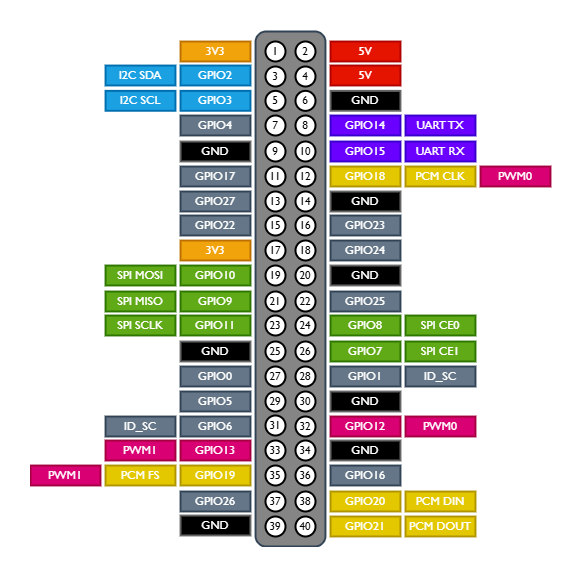

# General Purpose Input Output (GPIO) Port

The GPIO port connector is a 40-pin expansion header, arranged in a 2 x 20 strip.
The I/O ports are numbered as `GPIO nn`.

The GPIO provides 26 general-purpose bidirectional I/O pins.

An output pin can supply up to **16mA of current**. The total current drawn 
from all output pins should not exceed the 50mA limit.

## Power Pins

The Raspberry Pi comes with 3.2V and 5V pins: 

* **3.3V**: Pins number 1 and 17 
* **5V**: Pins 2 and 4

* **GND**: Pins number: 6, 9, 14, 20, 25, 30, 34, and 39

## PWM Pins

PWM stands for **Pulse Width Modulation** and it is used to control motors, 
define varying levels of LED brightness, define the color of RGB LEDs, and 
much more.

The Raspberry Pi has 4 **hardware PWM pins**: **GPIO 12**, **GPIO 13**, 
**GPIO 18**, **GPIO 19**.

We can have **software PWM on all pins**.

## I2C Pins

I2C means **Inter-Integrated Circuit**, and it is a synchronous, 
multi-master, multi-slave communication protocol. It allows us 
to establish communication with other microcontroller devices, 
sensors, or displays, for example. 
We can connect multiple I2C devices to the same pins as long 
they have a unique I2C address.

The Raspberry Pi I2C pins are:

* **SDA**: GPIO 2
* **SCL**: GPIO 3

If we want to use I2C, you need to enable the I2C communication 
interface first.

## I2C EEPROM

Pins 27 and 28 (GPIO 0 and GPIO 1) are reserved for connecting 
a HAT ID EEPROM. Do not use these pins unless you’re using an 
I2C ID EEPROM. Leave unconnected if you’re not using an I2C EEPROM

## SPI Pins

SPI stands for **Serial Peripheral Interface**, and it is a synchronous serial 
data protocol used by microcontrollers to communicate with one or more 
peripherals. This communication protocol allows us to connect multiple 
peripherals to the same bus interface, as long as each is connected to 
a different chip select pin.

These are the Raspberry Pi SPI pins:

* **MOSI**: GPIO 10
* **MISO**: GPIO 9
* **CLOCK**: GPIO 11

## Serial (UART) Pins

The UART pins can be used for Serial communication. The Raspberry Pi Serial 
(UART) pins are:

* **TX**: GPIO 14
* **RX**: GPIO 15

## References

* [Raspberry Pi Pinout Guide: How to use the Raspberry Pi GPIOs?](https://randomnerdtutorials.com/raspberry-pi-pinout-gpios/)