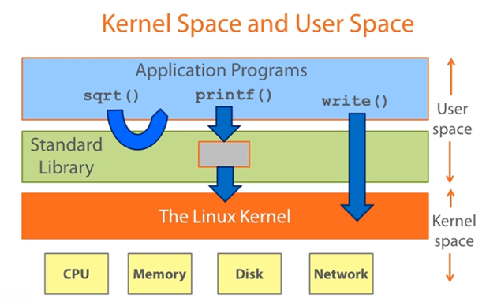

# Linux System Programming 

Linux System Programming refers to writing software that interacts directly 
with the Linux operating system kernel and core system libraries, rather 
than sitting high up in an application-level runtime.

It centers on using the fundamental APIs, primarily standard POSIX and 
Linux-specific system calls via the C standard library (glibc), to 
manage low-level resources. 

Developers write code to control process lifecycles, memory allocation, 
file descriptors, network sockets, signals, and hardware I/O, forming 
the foundational layer that makes user-facing applications and system 
daemons possible.

## User Space vs. Kernel Space

In Linux system architecture, memory and execution privileges are divided into 
two primary zones to ensure stability and security:

* **Kernel Space:** The privileged execution environment where 
**The Linux Kernel** runs with unrestricted access to underlying hardware 
(CPU, Memory, Disk, Network). It manages core resources, hardware interrupts, 
process scheduling, and device drivers.

* **User Space:** The restricted, unprivileged execution environment where 
**Application Programs** and runtime libraries execute. User applications 
are isolated from one another and cannot interact with physical hardware directly, 
preventing errant code from crashing the entire operating system.

## Standard Libraries vs. System Calls

* **Standard Libraries (e.g., `glibc`):** High-level interfaces providing 
    utility functions, abstractions, and standardized C APIs. 
    They run entirely in **User Space** and help optimize program execution:

    - **Pure computation (`sqrt()`):** Executed entirely within user space 
        via the math library without needing kernel intervention or context 
        switching.

    - **Higher-level abstraction (`printf()`):** Formats output and manages 
        user-space memory buffers, calling low-level system services only 
        when the buffer needs to be flushed.

* **System Calls (Syscalls, e.g., `write()`):** The programmatic gateway between 
    User Space and Kernel Space. Whenever a user program requires hardware 
    access (such as writing bytes to a file descriptor or terminal), it issues 
    a system call. This triggers a context switch from unprivileged mode to 
    privileged kernel mode, allowing the kernel to execute the hardware operation 
    safely on the program's behalf before returning control to user space.

## Topics in Linux System Programming

**File I/O & File Systems**

* **Low-Level File Descriptors:** Direct, unbuffered file operations using 
    `open()`, `read()`, `write()`, `close()`, and `lseek()`.

* **I/O Multiplexing & Event Notification:** Scalable synchronous event 
    monitoring across multiple file descriptors via `select()`, `poll()`, 
    and Linux-specific `epoll()`, as well as modern asynchronous I/O with 
    `io_uring`.

* **File System Operations & Metadata:** Managing inodes, hard/symbolic links, 
    file permissions, directory traversal (`opendir()`, `readdir()`), and 
    file monitoring via `inotify`.

**Process Management & Lifecycles**

* **Process Creation & Execution:** Spawning child processes using `fork()`, 
    replacing process images via the `exec()` family, and synchronizing 
    termination statuses with `wait()` / `waitpid()`.

* **Process Attributes & Groups:** Handling process IDs (`PID`, `PPID`), 
    sessions, controlling terminals, and daemonization (running detached 
    background services).

**Memory Management**

* **Virtual Memory Architecture:** Understanding the process address space 
    (stack, heap, data segments, text segment, and memory mapping segment).

* **Direct Page Mapping:** Using `mmap()` and `munmap()` for memory-mapped 
    file I/O, shared memory regions, and allocating anonymous pages directly 
    from the kernel.

* **Heap Manipulation:** Low-level dynamic memory control through `brk()` 
    and `sbrk()`, foundational to standard allocators like `malloc()`.

**Signals & Asynchronous Event Handling**

* **Signal Dispatching & Masks:** Registering handlers with `sigaction()`, 
    blocking/unblocking signals via `sigprocmask()`, and generating 
    software interrupts with `kill()` or `raise()`.

* **Async-Signal Safety:** Writing reentrant, safe signal handlers that 
    avoid non-reentrant standard library calls like `malloc()` or `printf()`.

**Inter-Process Communication (IPC)**

* **Data Streams & Messaging:** Unidirectional anonymous pipes (`pipe()`), 
    named pipes (`mkfifo()`), and POSIX message queues.

* **Shared Memory & Synchronization:** Zero-copy data exchange via POSIX 
    shared memory (`shm_open()`) paired with POSIX semaphores (`sem_init()`, 
    `sem_wait()`).

**POSIX Multithreading (Pthreads)**

* **Thread Lifecycle:** Creating and detaching execution contexts inside 
    the same address space with `pthread_create()`, `pthread_join()`, and 
    `pthread_detach()`.

* **Synchronization Primitives:** Preventing race conditions and 
    coordinating thread states using `pthread_mutex_t`, `pthread_rwlock_t`, 
    and condition variables (`pthread_cond_t`).

**Network Socket Programming**

* **Transport Protocols:** Stream-oriented (TCP) and datagram-oriented (UDP) 
    communication via the Berkeley Sockets API (`socket()`, `bind()`, 
    `listen()`, `accept()`, `connect()`).

* **Local Sockets:** Unix Domain Sockets (`AF_UNIX`) for high-performance, 
    secure local IPC without network stack overhead.

## References

* [YouTube (Chris Brown): Linux System Programming with C](https://youtube.com/playlist?list=PLysdvSvCcUhbrU3HhGhfQVbhjnN9GXCq4&si=Mk3o-qZxlVJln5zb)
    - [Kernel Space and User Space](https://youtu.be/p-vqh0KBtHM?si=6kpqplIUQ2-cJFXV)
    - [System Calls and Error Handling](https://youtu.be/No1vdnYPDjw?si=LlMK5PlCvNReb8PU)
    - [Systems Programming Example in C and Python](https://youtu.be/VHRvR7fiOP8?si=yYMCmanTwnvVMiSH)

